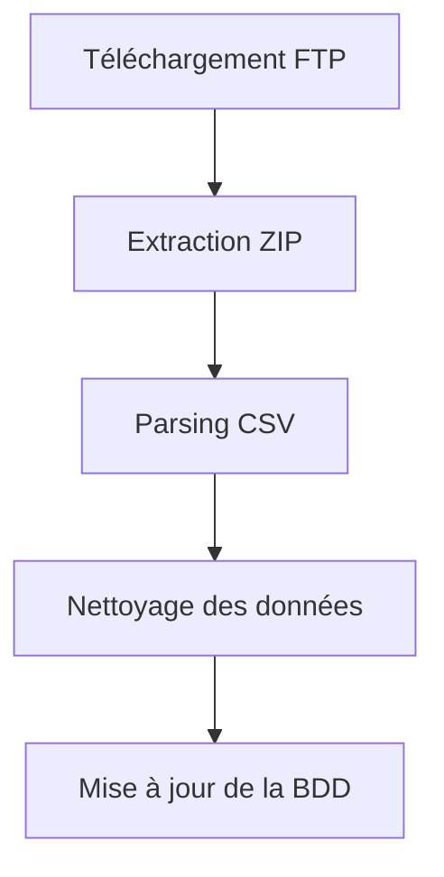

# Architecture du Projet - Kit le nid

Ce document présente l'architecture globale de l'application et détaille les différents composants utilisés.

## Sommaire

- [1. Vue d'ensemble](#1-vue-d'ensemble)
- [2. Structure du Répertoire](#2-structure-du-répertoire)
- [3. Workflow et Modules Clés](#3-workflow-et-modules-clés)
- [4. Diagramme d'Architecture](#4-diagramme-d'architecture)
- [5. Sécurité et Environnements](#5-sécurité-et-environnements)

## 1. Vue d'ensemble

L'application Kit le nid est construite autour d'une stack moderne et modulable :

- **Frontend :**

  - Next.js 15 avec React et TypeScript
  - Utilisation de composants UI réutilisables (ex. via Tailwind CSS)

- **Backend :**

  - API Routes de Next.js pour la logique serveur
  - Gestion des rendez-vous, formulaires et autres actions via des endpoints dédiés

- **Base de données :**

  - MongoDB piloté par Prisma ORM
  - Modèles de données définis dans le schéma Prisma (ex. `ProspectLancement`, `Meeting`, `FormulaireStudea`, etc.)

- **Internationalisation :**

  - Système maison basé sur des fichiers JSON pour la gestion des traductions

- **Déploiement :**
  - Mise en production avec PM2

## 2. Structure du Répertoire

L'organisation du code se présente de la manière suivante :

```
src/
├── actions/ # Actions et logique côté serveur
├── app/ # Routes et pages Next.js
├── components/ # Composants UI réutilisables
├── constants/ # Fichiers de configuration et constantes globales
├── db/ # Requêtes et accès à la base de données via Prisma
├── schemas/ # Schémas de validation (ex. avec Zod)
└── lib/ # Utilitaires et fonctions partagées
```

## 3. Workflow et Modules Clés

### 3.1 Gestion des Rendez-vous

- **Processus :**

  - Réception des données via l'endpoint `/api/meetings`.
  - Vérification de la disponibilité du créneau.
  - Création du rendez-vous dans la base de données.
  - Envoi d'un email de confirmation contenant un fichier ICS.

- **Points Importants :**
  - Validation stricte des données entrantes.
  - Gestion des erreurs (ex. créneau déjà réservé).

### 3.2 Gestion des Transports

- **Processus :**

  - Réception des coordonnées géographiques via l'endpoint `/api/transport`.
  - Utilisation du service dédié `transportService.ts` pour récupérer les informations de transport.
  - Gestion des icônes de transport avec fallback sur des icônes par défaut :
    - Utilisation d'icônes spécifiques pour Paris, Lyon et Marseille
    - Fallback sur des icônes par défaut (`default-metro.svg`, `default-tram.svg`, `default-train.svg`, `default-bus.svg`) pour les autres régions
  - Traitement et formatage des données de transport.
  - Renvoi des informations structurées au client.

- **Points Importants :**
  - Service indépendant et modulaire.
  - Optimisation des performances de requête.
  - Gestion robuste des cas où aucun transport valide n'est disponible.
  - Support des icônes spécifiques par région avec fallback sur des icônes par défaut.

### 3.3 Gestion des Programmes

- **Processus :**

  - Création, modification (`updateProgramAction`, `EditProgramAction`, `EditProgramForm`, hook `useEditProgramForm`) et suppression de programmes immobiliers.
  - Intégration d'un éditeur de texte pour les descriptions et fonctionnalité d'upload pour les brochures.
  - Gestion des images avec réordonnancement par glisser-déposer via `@dnd-kit`.
  - Gestion des lots (ajout, suppression, modification y compris PDF) et des propriétés associées.
  - La logique concernant les favoris a été séparée des requêtes principales de programme (`program.query.ts`).
  - Calcul dynamique des prix via un utilitaire dédié.
  - Téléchargement et gestion des fichiers liés aux programmes.

- **Composants clés :**
  - `programActions.ts` et `updateProgramAction` pour les actions serveur.
  - Hooks personnalisés (`useProgramForm`, `useEditProgramForm`) pour la gestion des formulaires.
  - Composants de formulaire (`AddProgramModal`, `EditProgramForm`) intégrant éditeur de texte, upload de fichiers et `@dnd-kit`.
  - Système de calcul de prix.
  - Interface utilisateur dédiée avec composants Shadcn UI.

### 3.4 Gestion des Régions

- **Processus :**

  - Mapping des données régionales pour les départements français.
  - Calcul des coordonnées et traitement des informations géographiques.
  - Intégration avec les détails de propriété.

- **Composants clés :**
  - Utilitaires de traitement des noms de fichiers
  - Fonctions de calcul de coordonnées
  - Intégration cartographique

### 3.5 Import de Données MBI (Système hérité)

- **Processus :**

  - Téléchargement du fichier ZIP via FTP.
  - Extraction du fichier ZIP et parsing du CSV.
  - Nettoyage des données et mise à jour de la base de données.

- **Workflow (mermaid) :**



### 3.6 Gestion des Formulaires

- **Modules implémentés :**
  - **Formulaire Studea**
  - **Formulaire La Banque Postale**
  - **Formulaire de lancement**
  - **Formulaire de programme**
- **Validation :**
  - Utilisation de Zod pour garantir la cohérence des données saisies par l'utilisateur.

## 4. Diagramme d'Architecture

Voici un diagramme simplifié montrant l'interaction entre les différents composants :

```mermaid
graph TD
    A[Client / Navigateur] --> B[Next.js (Frontend)]
    B --> C[API Routes Next.js (Backend)]
    C --> D[Prisma / PostgreSQL]
    C --> E[Services externes (FTP, Email)]
```

## 5. Sécurité et Environnements

- **Configuration :**
  - Les fichiers d'environnement (`.env`) contiennent les clés sensibles et ne doivent jamais être versionnés.
- **Déploiement :**
  - Les déploiements en pré-production et production sont gérés via PM2.
- **Tests et Maintenabilité :**
  - La couverture de tests est assurée par Vitest.
  - Les conventions de code et l'utilisation d'ESLint/Prettier garantissent un code de qualité et maintenable.
