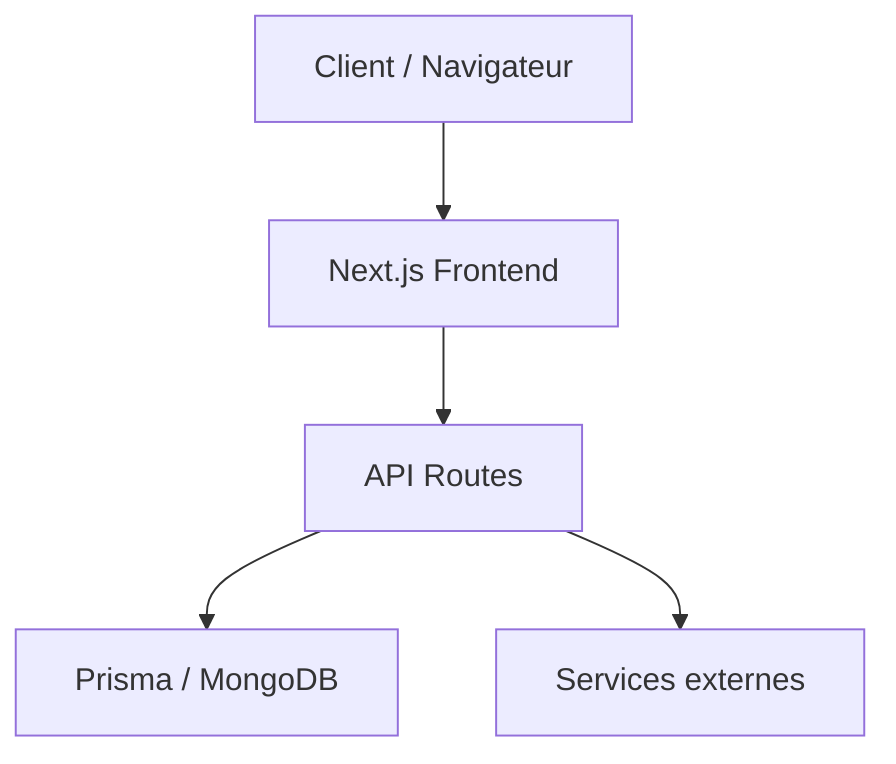
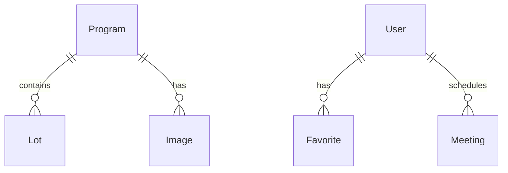
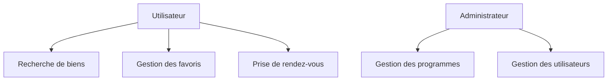
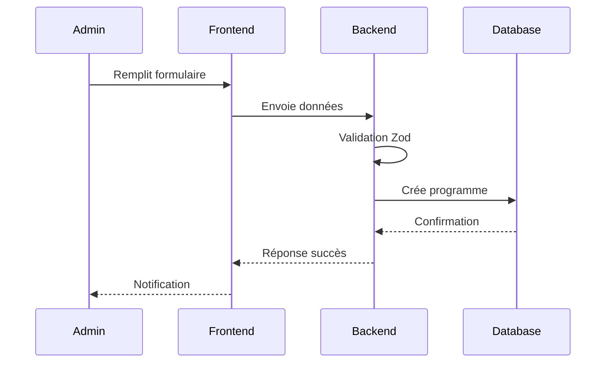

# Dossier Projet - Kit le nid

## 1. Compétences mises en œuvre

### Développement Web

- Next.js 15 avec React et TypeScript
- Tailwind CSS pour l'interface utilisateur
- API Routes pour le backend
- MongoDB avec Prisma ORM
- Gestion des formulaires avec validation Zod

### Architecture et Conception

- Architecture modulaire et évolutive
- Design patterns (MVC, Repository)
- Gestion des états avec hooks personnalisés
- Intégration de services externes (FTP, Email)

### Sécurité et Performance

- Authentification via NextAuth
- Validation des données avec Zod
- Gestion des fichiers et uploads sécurisés
- Optimisation des requêtes MongoDB
- Gestion des index géospatiaux

## 2. Expression des besoins

### Objectifs du projet

- Création d'une plateforme immobilière moderne et performante
- Gestion complète des programmes immobiliers
- Système de recherche géographique avancé
- Gestion des rendez-vous avec synchronisation calendrier
- Interface d'administration complète

### Contraintes techniques

- Performance et scalabilité
- Sécurité des données
- Compatibilité multi-navigateurs
- Responsive design
- Intégration avec des services externes

## 3. Présentation de l'entreprise et du service

### Kit le nid

Kit le nid est une initiative du groupe immobilier Nexity, créée spécifiquement pour répondre aux besoins des jeunes acheteurs immobiliers. Notre mission est de simplifier et digitaliser le parcours d'achat immobilier pour cette cible souvent délaissée par le marché traditionnel.

#### Notre mission

- Accompagner les jeunes dans leur projet d'accession à la propriété
- Simplifier et digitaliser le parcours d'achat
- Rendre l'immobilier accessible aux nouvelles générations
- Offrir un accompagnement personnalisé et transparent

#### Notre approche

- Service 100% digital avec un accompagnement humain
- Transparence totale sur les prix et les conditions
- Solutions financières adaptées aux jeunes acheteurs
- Expertise du groupe Nexity au service des nouveaux acquéreurs

### Services proposés

#### I. Accompagnement financier personnalisé

- Conseil financier gratuit
- Solutions d'apport réduit avec délai d'augmentation
- Prêt à Taux Zéro de 75.000€ à 125.000€
- Frais de notaire offerts
- Accompagnement dans la constitution du dossier

#### II. Accès à un large choix de logements

- Plus de 30.000 logements neufs Nexity et partenaires
- Couverture nationale
- Documentation complète (plans, brochures) téléchargeable
- Recherche simplifiée par localisation

#### III. Accompagnement personnalisé

- Un conseiller unique dédié
- Suivi du projet de A à Z :
  - Recherche du bien
  - Constitution du dossier
  - Accompagnement jusqu'à l'emménagement
- Support continu via la plateforme digitale

#### IV. Solutions digitales

- Interface de recherche intuitive
- Gestion des rendez-vous en ligne
- Suivi de dossier en temps réel
- Documents et formulaires accessibles 24/7
- Notifications et alertes personnalisées

### Notre différenciation

- Focus exclusif sur les jeunes acheteurs
- Approche 100% digitale avec service humain
- Solutions financières avantageuses
- Expertise du groupe Nexity
- Accompagnement personnalisé de bout en bout

## 4. Gestion de projet

### Planning et suivi

- Utilisation de Git pour le versioning
- Workflow de développement avec branches
- Déploiement continu avec PM2
- Environnements de développement, pré-production et production

### Environnement humain

- Équipe de développement agile
- Communication régulière
- Code reviews
- Documentation technique maintenue à jour

### Objectifs de qualité

- Tests unitaires et d'intégration avec Vitest
- ESLint et Prettier pour la qualité du code
- Documentation technique complète
- Suivi des bonnes pratiques de développement

## 5. Spécifications fonctionnelles

Pour plus de détails sur l'architecture et l'implémentation technique, veuillez consulter le document [ARCHITECTURE.md](./ARCHITECTURE.md).

### Architecture logicielle

Pour une description détaillée de l'architecture, voir [ARCHITECTURE.md](./ARCHITECTURE.md#1-vue-d'ensemble).



### Maquettes et enchaînements

#### TODO: Captures d'écran des interfaces utilisateur

##### Page d'accueil

```typescript
// TODO: Code du composant HomePage
```

##### Recherche de biens

```typescript
// TODO: Code du composant SearchPage
```

##### Détail d'un programme

```typescript
// TODO: Code du composant ProgramDetail
```

##### Interface d'administration

```typescript
// TODO: Code du composant AdminDashboard
```

Pour plus de détails sur les composants et leur implémentation, voir [ARCHITECTURE.md](./ARCHITECTURE.md#3-workflow-et-modules-clés).

## 6. Modèle de données

Pour une description complète du modèle de données et des relations, voir [ARCHITECTURE.md](./ARCHITECTURE.md#3-workflow-et-modules-clés).

### Modèle entités-associations



### Modèle physique

```prisma
model Program {
  id               String    @id @default(auto()) @map("_id") @db.ObjectId
  programReference String?   @unique
  title            String
  description      String
  location         Json
  lots             Lot[]
  images           Image[]
  createdAt        DateTime  @default(now())
}

model Lot {
  id          String   @id @default(auto()) @map("_id") @db.ObjectId
  programId   String   @db.ObjectId
  program     Program  @relation(fields: [programId], references: [id])
  number      Int
  price       Float
  surface     Float
  rooms       Int
  pdfPlan     String?
}
```

## 7. Diagrammes de cas d'utilisation

### Diagramme des cas d'utilisation principaux



### Diagramme de séquence - Création d'un programme



## 8. Spécifications techniques

Pour plus de détails sur les aspects techniques, voir [ARCHITECTURE.md](./ARCHITECTURE.md#5-sécurité-et-environnements).

### Sécurité

- Authentification via NextAuth
- Validation des données avec Zod
- Protection CSRF
- Gestion sécurisée des fichiers
- Contrôle d'accès basé sur les rôles

### Extraits de code significatifs

#### Composant métier - Gestion des programmes

```typescript
export const updateProgramAction = async (data: UpdateProgramSchema) => {
  const validatedData = updateProgramSchema.parse(data);
  const program = await prisma.program.update({
    where: { id: validatedData.id },
    data: {
      title: validatedData.title,
      description: validatedData.description,
      // ... autres champs
    },
  });
  return program;
};
```

#### Composant d'accès aux données

```typescript
export const getPropertiesRaw = async (inputs: SearchInputs) => {
  const pipeline = [
    {
      $geoNear: {
        near: inputs.near,
        distanceField: "distance",
        maxDistance: 60000,
        spherical: true,
      },
    },
    // ... autres étapes
  ];
  return await prisma.program.aggregateRaw({ pipeline });
};
```

### Plan de tests

- Tests unitaires avec Vitest
- TODO: Captures d'écran des tests et résultats

### Jeu d'essai - Recherche de propriétés

#### Données en entrée

```json
{
  "city": "Paris",
  "coordinates": [2.3522, 48.8566],
  "radius": 60
}
```

#### Données attendues

```json
{
  "data": [
    {
      "id": "property_1",
      "title": "Appartement T3",
      "location": {
        "type": "Point",
        "coordinates": [2.3522, 48.8566]
      }
    }
  ],
  "metadata": {
    "totalResults": 10,
    "page": 1
  }
}
```

### Veille sécurité

- Suivi des vulnérabilités Next.js
- Mise à jour régulière des dépendances
- Audit de sécurité des API
- Protection contre les injections
- Gestion sécurisée des fichiers uploadés
