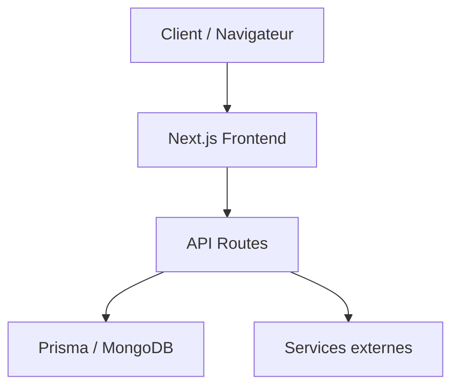
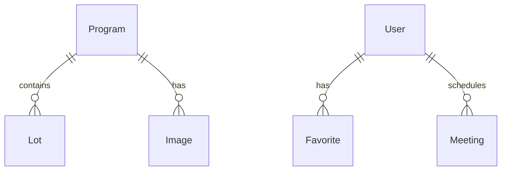
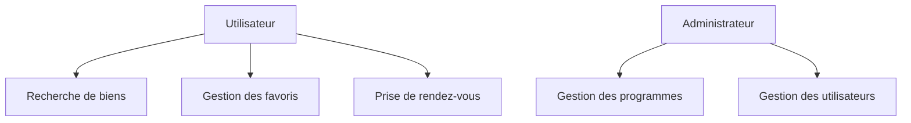
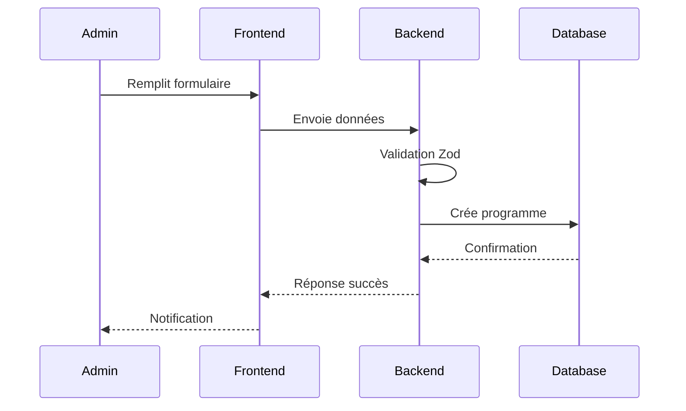

# Dossier Projet - Kit le nid

## 1. Compétences mises en œuvre

### Développement Web

- Next.js 15 avec React et TypeScript
- Tailwind CSS pour l'interface utilisateur
- API Routes pour le backend
- MongoDB avec Prisma ORM
- Gestion des formulaires avec validation Zod

### Architecture et Conception

- Architecture modulaire et évolutive
- Design patterns (MVC, Repository)
- Gestion des états avec hooks personnalisés
- Intégration de services externes (FTP, Email)

### Sécurité et Performance

- Authentification via NextAuth
- Validation des données avec Zod
- Gestion des fichiers et uploads sécurisés
- Optimisation des requêtes MongoDB
- Gestion des index géospatiaux

## 2. Expression des besoins

### Objectifs du projet

- Création d'une plateforme immobilière moderne et performante
- Gestion complète des programmes immobiliers
- Système de recherche géographique avancé
- Gestion des rendez-vous avec synchronisation calendrier
- Interface d'administration complète

### Contraintes techniques

- Performance et scalabilité
- Sécurité des données
- Compatibilité multi-navigateurs
- Responsive design
- Intégration avec des services externes

## 3. Présentation de l'entreprise et du service

### Kit le nid

- Entreprise spécialisée dans l'immobilier
- Focus sur l'expérience utilisateur
- Service de gestion de programmes immobiliers
- Interface moderne et intuitive

### Services proposés

- Recherche de biens immobiliers
- Gestion des rendez-vous
- Administration des programmes
- Suivi des prospects
- Gestion des formulaires

## 4. Gestion de projet

### Planning et suivi

- Utilisation de Git pour le versioning
- Workflow de développement avec branches
- Déploiement continu avec PM2
- Environnements de développement, pré-production et production

### Environnement humain

- Équipe de développement agile
- Communication régulière
- Code reviews
- Documentation technique maintenue à jour

### Objectifs de qualité

- Tests unitaires et d'intégration avec Vitest
- ESLint et Prettier pour la qualité du code
- Documentation technique complète
- Suivi des bonnes pratiques de développement

## 5. Spécifications fonctionnelles

### Contraintes et livrables

- Application web responsive
- API RESTful
- Base de données MongoDB
- Documentation technique
- Tests automatisés

### Architecture logicielle



### Maquettes et enchaînements

- Interface utilisateur moderne avec Tailwind CSS
- Composants réutilisables
- Navigation intuitive
- Formulaires dynamiques
- Visualisation cartographique

## 6. Modèle de données

### Modèle entités-associations



### Modèle physique

```prisma
model Program {
  id               String    @id @default(auto()) @map("_id") @db.ObjectId
  programReference String?   @unique
  title            String
  description      String
  location         Json
  lots             Lot[]
  images           Image[]
  createdAt        DateTime  @default(now())
}

model Lot {
  id          String   @id @default(auto()) @map("_id") @db.ObjectId
  programId   String   @db.ObjectId
  program     Program  @relation(fields: [programId], references: [id])
  number      Int
  price       Float
  surface     Float
  rooms       Int
  pdfPlan     String?
}
```

## 7. Diagrammes de cas d'utilisation

### Diagramme des cas d'utilisation principaux



### Diagramme de séquence - Création d'un programme



## 8. Spécifications techniques

### Sécurité

- Authentification via NextAuth
- Validation des données avec Zod
- Protection CSRF
- Gestion sécurisée des fichiers
- Contrôle d'accès basé sur les rôles

### Extraits de code significatifs

#### Composant métier - Gestion des programmes

```typescript
export const updateProgramAction = async (data: UpdateProgramSchema) => {
  const validatedData = updateProgramSchema.parse(data);
  const program = await prisma.program.update({
    where: { id: validatedData.id },
    data: {
      title: validatedData.title,
      description: validatedData.description,
      // ... autres champs
    },
  });
  return program;
};
```

#### Composant d'accès aux données

```typescript
export const getPropertiesRaw = async (inputs: SearchInputs) => {
  const pipeline = [
    {
      $geoNear: {
        near: inputs.near,
        distanceField: "distance",
        maxDistance: 60000,
        spherical: true,
      },
    },
    // ... autres étapes
  ];
  return await prisma.program.aggregateRaw({ pipeline });
};
```

### Plan de tests

- Tests unitaires avec Vitest
- Tests d'intégration
- Tests de sécurité
- Tests de performance
- Tests de compatibilité navigateurs

### Jeu d'essai - Recherche de propriétés

#### Données en entrée

```json
{
  "city": "Paris",
  "coordinates": [2.3522, 48.8566],
  "radius": 60
}
```

#### Données attendues

```json
{
  "data": [
    {
      "id": "property_1",
      "title": "Appartement T3",
      "location": {
        "type": "Point",
        "coordinates": [2.3522, 48.8566]
      }
    }
  ],
  "metadata": {
    "totalResults": 10,
    "page": 1
  }
}
```

### Veille sécurité

- Suivi des vulnérabilités Next.js
- Mise à jour régulière des dépendances
- Audit de sécurité des API
- Protection contre les injections
- Gestion sécurisée des fichiers uploadés
